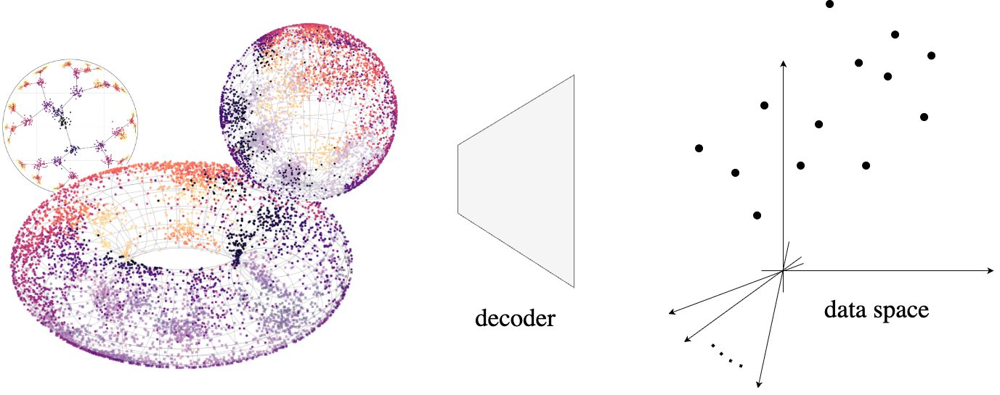

# Riemannain generative decoder: <br>*learning representations on manifolds*



<div align="center">
<a href="https://yhsure.github.io/riemannian-generative-decoder/" target="_blank"></a>
<a href="https://arxiv.org/abs/" target="_blank"></a>
<a href="https://huggingface.co/datasets/yhsure/riemannian-generative-decoder/tree/main" target="_blank"></a>
</div><br>

> **Riemannian generative decoder**<br>
> Andreas Bjerregaard, Søren Hauberg and Anders Krogh<br>
> <a href="http://arxiv.org/abs/" target="_blank">http://arxiv.org/abs/ </a> <br>
> 
> **Abstract:**
> Riemannian representation learning typically relies on approximating densities on chosen manifolds. This involves optimizing difficult objectives, potentially harming models. To completely circumvent this issue, we introduce the Riemannian generative decoder which finds manifold-valued maximum likelihood latents with a Riemannian optimizer while jointly training a decoder network. By discarding the encoder, we vastly simplify the manifold constraint compared to current approaches which can often only handle few specific manifolds. We validate our approach on three case studies — a synthetic branching diffusion process, human migrations inferred from mitochondrial DNA, and cells undergoing a cell division cycle — each showing that learned representations respect the prescribed geometry and capture intrinsic non-Euclidean structure. Our method requires only a decoder, is compatible with existing architectures, and yields interpretable latent spaces aligned with data geometry. 

## Running the project
To reproduce results from the paper, follow the steps below. All notebooks will automatically fetch any required data. 


0. **Clone the repo (with submodules)**  
   ```bash
   git clone --recurse-submodules https://github.com/fvk220/riemannian-generative-decoder.git
   ```
   and install the geoopt submodule: `pip install -e data/geoopt`

1. **Cell cycle in human fibroblasts** [1]
   - Run `1) CellCycle.ipynb` to reproduce figures.

2. **Synthetic branching diffusion process** [2]
   - Run `2) BranchingDiffusion.ipynb` to reproduce figures.

3. **Human mitochondrial DNA** [3]
   - Run `3) hmtDNA*.ipynb` notebooks to reproduce figures.  
   - For instructions on scraping new (updated) mitochondrial sequences, see the below section [Scraping new mitochondrial sequences](#scraping-new-mitochondrial-sequences).

All the used data can also be downloaded from [🤗 HuggingFace](https://huggingface.co/datasets/yhsure/riemannian-generative-decoder/tree/main) to avoid cloning the repo.


### Scraping new mitochondrial sequences
If you wish to make an updated scrape of human mitochondrial sequences, run the following Python script:
```python
from Bio import Entrez
from tqdm import tqdm

Entrez.email = "your_email@gmail.com"
query = '(00000015400[SLEN] : 00000016700[SLEN]) AND "Homo"[Organism] AND mitochondrion[FILT] NOT (unverified[All Fields] OR ("Homo sapiens subsp. \'Denisova\'"[Organism] OR Homo sp. Altai[All Fields]) OR ("Homo sapiens subsp. \'Denisova\'"[Organism] OR Denisova hominin[All Fields]) OR neanderthalensis[All Fields] OR heidelbergensis[All Fields] OR consensus[All Fields])'

handle = Entrez.esearch(db="nuccore", term=query, retmax=100000)
record = Entrez.read(handle)
id_list = record["IdList"]
with open("seqs.fasta", "w") as outfile:
    for start in tqdm(range(0, len(id_list), 500), desc="Downloading sequences"):
        fetch_ids = id_list[start:start+500]
        handle = Entrez.efetch(db="nuccore", id=fetch_ids, rettype="fasta", retmode="text")
        records = handle.read()
        outfile.write(records)
```
Then, use *haplogrep3* [4] to annotate the sequences using either an RSRS or rCRS tree: 
```bash
$ haplogrep3 classify --in "seqs.fasta" --out seqs_rsrs.txt --tree phylotree-rsrs@17.0 --extend-report
$ haplogrep3 classify --in "seqs.fasta" --out seqs_rcrs.txt --tree phylotree-fu-rcrs@1.2 --extend-report
```
This generates a file with mutations compared to a reference sequence, as well as more metadata — see the [*haplogrep3* documentation][haplogrep] for details. Additional metadata (e.g., geographic location) can be added during a second GenBank scrape; merging such data with the *haplogrep3* output produces the zipped files `data/hmtDNA/63k_out_rcrs.txt.gz` and `data/hmtDNA/63k_out_rsrs.txt.gz`. Upon approval, this pipeline will be made available as a standalone script, and a resulting snapshot will be published via Zenodo.

## Requirements
The code has been tested with Python 3.11.11 using the packages from `requirements.txt`. Use the geoopt 0.5.1 submodule (including a sphere origin function) with `$ pip install -e data/geoopt`.


[hfibro]: https://zenodo.org/records/4719436/files/velocity_anndata_human_fibroblast_DeepCycle_ISMARA.h5ad?download=1
[branching]: https://github.com/emilemathieu/pvae/blob/master/pvae/datasets/datasets.py
[haplogrep]: https://haplogrep.readthedocs.io/

## Acknowledgements
We thank the developers of *geoopt* [5] and *haplogrep3* [4], the *QuickGO* [6] and *MITOMAP* projects [3] as well as Riba *et al.* [1] and Mathieu *et al.* [2] for making their software and data publicly available.

We further thank Viktoria Schuster, Iñigo Prada-Luengo, Yan Li, Adrián Sousa-Poza and Valentina Sora for helpful discussions. This work was funded by the Novo Nordisk Foundation (NNF) through the Center for Basic Machine Learning in Life Science (NNF grant <span style="word-break: break-all;">NNF20OC0062606</span>) and the Pioneer Centre for AI (DNRF grant number P1). A.K. was further supported by NNF grants <span style="word-break: break-all;">NNF20OC0059939</span> and <span style="word-break: break-all;">NNF20OC0063268</span>. 


## Citation
```bibtex
@inproceedings{bjerregaard2025riemannian,
  title={Riemannian generative decoder},
  author={Bjerregaard, Andreas and Hauberg, S{\o}ren and Krogh, Anders},
  booktitle={ICML 2025 Generative AI and Biology (GenBio) Workshop}
}
```


## Bibliography
1. A. Riba, A. Oravecz, M. Durik, S. Jiménez, V. Alunni, M. Cerciat, M. Jung, C. Keime, W. M. Keyes, and N. Molina. "Cell cycle gene regulation dynamics revealed by RNA velocity and deep-learning". *Nature Communications*, 13(1):2865, 2022.

2. E. Mathieu, C. Le Lan, C. J. Maddison, R. Tomioka, and Y. W. Teh. "Continuous hierarchical representations with Poincaré variational auto-encoders". *Advances in Neural Information Processing Systems*, 32, 2019.

3. MITOMAP: A Human Mitochondrial Genome Database. http://www.mitomap.org, 2023. Database.

4. S. Schönherr, H. Weissensteiner, F. Kronenberg, and L. Forer. "Haplogrep 3—an interactive haplogroup classification and analysis platform". *Nucleic Acids Research*, 51(W1):W263–W268, 2023. Software.

5. L. Kochurov, R. Karimireddy, and S. Reddi. "Geoopt: Riemannian optimization in PyTorch". *arXiv preprint arXiv:2005.02819*, 2020. Software.

6. D. Binns, E. Dimmer, R. Huntley, D. Barrell, C. O'Donovan, and R. Apweiler. "QuickGO: a web-based tool for Gene Ontology searching". *Bioinformatics*, 25(22):3045–3046, 2009. Database.
